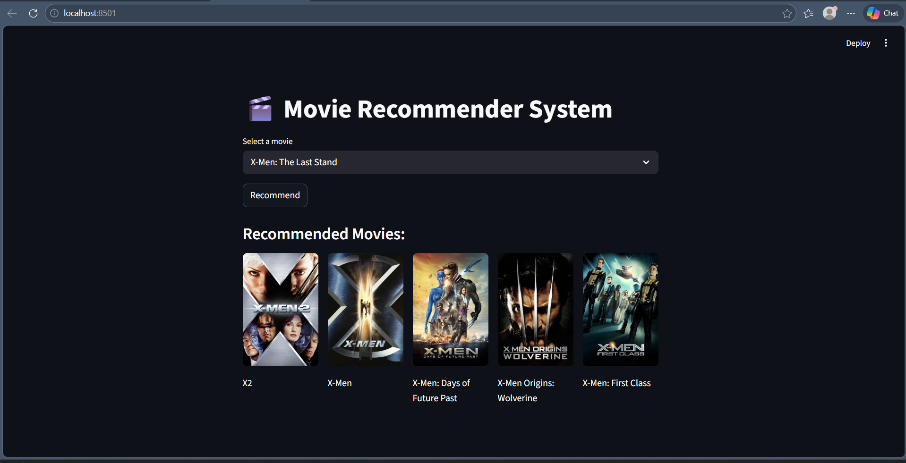

# 🎬 Movie Recommendation System

A machine learning-based movie recommendation system built using Streamlit.

##  Features

* Recommend similar movies
* Interactive UI using Streamlit
* Uses cosine similarity

##  Tech Stack

* Python
* Pandas
* Scikit-learn
* Streamlit

##  Run Locally

pip install -r requirements.txt
streamlit run app/app.py

<h2>Output</h2>

  

##  Note

Model `.pkl` files are not included due to size.
